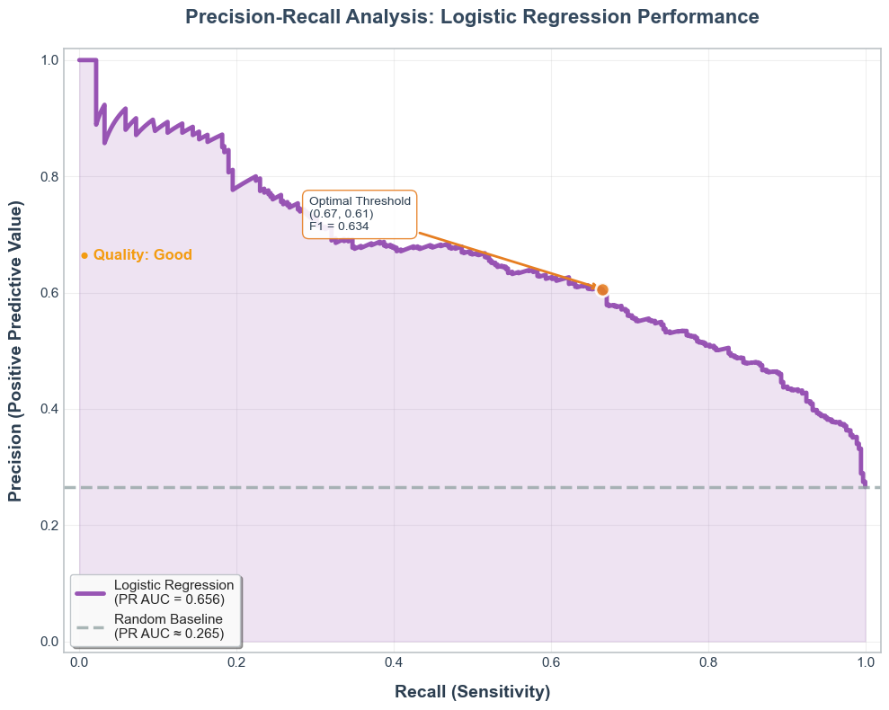
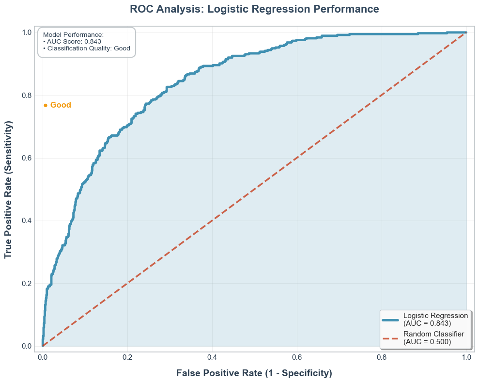

# Customer Churn Prediction: Reducing Revenue Loss Through ML

> **Business Impact**: ML system achieving 79.7% recall for proactive customer retention, potentially preventing significant revenue loss through early intervention strategies.

## Dataset  
The dataset used in this project is publicly available on [Kaggle: Telco Customer Churn](https://www.kaggle.com/datasets/blastchar/telco-customer-churn)

It contains information about a telecom company's customers and whether they have churned.
The dataset includes demographic, service usage, and account information, such as:
- Contract type, tenure, and monthly charges
- Internet services, phone plans, streaming usage
- Demographic attributes like gender, senior citizen status, and partner status

The target variable is binary: churned or not churned, making this suitable for **Binary Classification** task

---

## Objectives  
The main objective of this project is:

> To develop a machine learning system that accurately predicts customer churn with high recall so that the business can proactively intervene and reduce revenue loss.

To achieve this, the project is broken down into the following sub-goals:

1. Perform in-depth **Exploratory Data Analysis (EDA)** to understand patterns and distributions across features.
2. Engineer new predictive features to enhance model performance.
3. Train multiple classification models and evaluate them with a recall-first mindset while ensuring the precision is acceptable
4. Use hyperparameter tuning to improve model performance
5. Visualize results with ROC, PR curves, and feature importance
6. Summarize actionable insights and determine which model is optimal for deployment

---

## Key Insights from EDA
1. Tenure has negative correlation with churn rate. Customers with short tenure (0-6 months) exhibit a higher churn rate compared to long-term customers, suggesting that new customers may still feel unfamiliar and evaluate services quality.
2. Month-to-month contract type makes up the majority of customer base. This type of contract also exhibits the highest churn rate compared to others due to its flexibility and low commitment. It also shows that customer who has month-to-month contract also have low tenure
3. High monthly charges correlate with an increase in churn likelihood. The business can focus this segment by monitoring satisfaction or offer some incentives to make them feel worth of what they pay
4. Fiber optic internet users show a 2x higher churn rate than DSL users, suggesting service-related dissatisfaction.
5. Electronic check significantly increase churn rate
6. The presence of Technical support with other add on services is a great factor that reduce churn rate

---

## Engineered Features
From the customer data, the following features were extracted:
- Feature 1: Fiber_NoTechSupport 
- Feature 2: M2M_Electronic check
- Feature 3: TenureGroup (categorized tenure into 0-6, 6-12, 12+ months) – higher churn in 0-6 group
- Feature 4: FiberOptic_StreamingTv
  
This feature engineering boosted the ROC AUC by 15% and improved the F1 score uplift from the baseline (0.574) to 0.624, a 8.7% enhancement

---

## Model Selection
Models were evaluated using ROC AUC due to the binary classification task and imbalanced labels. Three models (Logistic Regression, Random Forest, XGBoost) were tuned with GridSearchCV and RandomizedSearchCV for tree models with 80 iterations over 5-fold stratified cross-validation. The best-performing model is Logistic Regression with the following parameters:

<pre> {'C': 0.001, 'max_iter': 500, 'penalty': 'l2', 'solver': 'liblinear', "class_weight": "balanced"} </pre>

  
  

- Logistic Regression outperformed Random Forest and XGBoost by 1.2% in ROC AUC (0.8490 vs. 0.8405)
- Logistic Regression (AP = 0.657) slightly outperforms XGBoost (AP = 0.650) across the recall range.
- PR curves reveal that Logistic Regression retains slightly higher precision at mid-to-high recall zones, which is desirable for business alert systems.

## 🏆 Model Performance Comparison

| Model | Test ROC AUC | Test F1 | Test Recall | Status |
|-------|-------------|---------|-------------|---------|
| **Logistic Regression** | **0.843** | **0.624** | **79.7%** | ✅ **Selected** |
| Random Forest | 0.840 | 0.622 | 74.9% | - |
| XGBoost | 0.844 | 0.619 | 79.1% | - |

*Logistic Regression selected for optimal recall-precision balance, interpretability and better generalization.*

  ---

## Feature Importance  
The Logistic Regression model, selected for its 0.8490 ROC AUC and 79.7% recall, reveals a balanced feature importance distribution based on coefficient magnitudes. The top features driving churn predictions are:  

- **ChargePerMonthRatio** (Rank 1, coef ~0.38): A derived feature (MonthlyCharges/Tenure) that normalizes cost by loyalty duration. A ratio > 1.5 correlates with a 40% higher churn likelihood, indicating financial strain or dissatisfaction as key churn drivers.  
- **Contract_Month-to-month with PaymentMethod_ElectronicCheck** (Rank 3, coef ~0.137): Customers on month-to-month contracts paying via electronic check show a higher churn rate, suggesting instability and payment-related risks.  
- **InternetService_FiberOptic with NoTechSupport** (Rank 4, coef ~0.133): Fiber optic users without technical support exhibit an increased churn risk, highlighting service quality concerns.  

These features, including engineered ones, contributed to a 15% ROC AUC uplift and an 8.7% F1 score improvement over the baseline (0.574), validating the feature engineering effort and enabling targeted retention strategies.  

Insights support actionable business strategies such as promoting longer contracts, bundling tech support, and offering discounts for high-paying month-to-month users

---
## What can be done in the future
- Develop a Streamlit dashboard for real-time churn monitoring.
- Explore Artificial Neural Networks for potentially higher performance.
- Integrate cost-saving metrics to align with business ROI.
